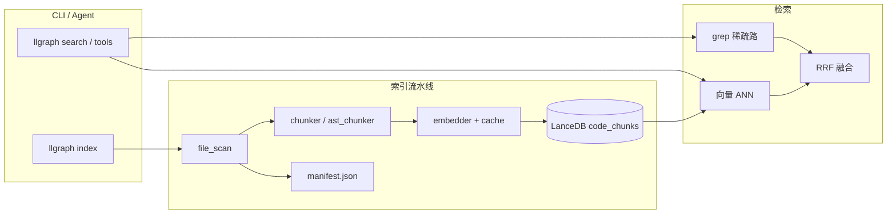

# Code Index 设计与使用

llgraph 在工作区内维护**本地代码向量索引**，供 `llgraph search` 与 Agent 工具 `search_code_hybrid` / `search_code_semantic` 使用。数据不落云端，目录为 `<workspace>/.llgraph/index/`（建议加入 `.gitignore`）。

---

## 1. 架构概览



| 组件 | 路径 | 职责 |
|------|------|------|
| 文件扫描 | `code_index/file_scan.py` | 复用工作区忽略规则，枚举可索引源码 |
| 切块 | `code_index/chunker.py` | 默认按行窗口滑动切块 |
| AST 切块 | `code_index/ast_chunker.py` | 可选 tree-sitter，按函数/类边界 |
| 向量化 | `code_index/embedder.py` | Gateway OpenAI 兼容 `/v1/embeddings` |
| 存储 | `code_index/store.py` | LanceDB 表 `code_chunks` |
| 增量 | `code_index/manifest.py` | 文件 SHA256 → 是否跳过 |
| 编排 | `code_index/indexer.py` | 全量 / 增量 / 重建 |
| 重建清理 | `code_index/rebuild.py` | 删表、清 manifest、可选清 embed 缓存 |
| Hybrid | `code_index/hybrid.py` | grep + 向量 + RRF |
| 日志 | `code_index/index_logging.py` | 控制台 + 落盘 |

---

## 2. 技术选型

| 决策点 | 选择 | 原因 |
|--------|------|------|
| 向量库 | **LanceDB**（本地目录） | 嵌入式、无独立服务、与 Python 集成简单 |
| Embedding 默认 | **本地 sentence-transformers** | 不依赖 Gateway；离线可索引 |
| Embedding 可选 | **远程 Gateway** `/v1/embeddings` | `embedding.json` 中 `"provider": "remote"` |
| 默认本地模型 | `BAAI/bge-small-zh-v1.5`（512 维） | 适合中文注释/文档；可改 HuggingFace 模型名 |
| 切块默认 | **行窗口**（约 40 行、重叠 8 行） | 无额外依赖、语言无关 |
| 切块增强 | **tree-sitter AST**（`--ast`） | 语义边界更准，需 `pip install -e '.[ast]'` |
| 检索融合 | **RRF**（Reciprocal Rank Fusion, k=60） | 不依赖两路分数标定，工程上稳定 |
| 稀疏路 | 工作区内 **正则 grep**（token 自 query 抽取） | 补关键词/类名命中，零成本 |
| 向量缓存 | **SQLite** `embed_cache.db`（content_hash → vector） | 增量索引时避免重复计费 |

与 **Cursor 内置索引** 的差异：llgraph 索引完全本地、可 CLI 重建、日志可审计；不读取 Cursor 的 index 服务。

---

## 3. 索引流程

### 3.1 全量（`llgraph index`）

1. 扫描 `path_prefix` 下可索引文件，计算 SHA256，写入待处理列表。
2. **删除** Lance 表 `code_chunks`（整表 drop 后重建）。
3. 对每个文件：切块 → batch embed → `upsert` 到 Lance。
4. 写满 `manifest.json`；删除 manifest 中已不存在的文件的 chunk。
5. 更新 `meta.json`（`vector_dim`、`last_indexed_at`）。

### 3.2 增量（`--incremental`）

1. 加载旧 `manifest.json`。
2. 仅当文件 SHA 与 manifest 不一致时进入待处理列表。
3. **不** drop 整表；对每个变更文件先 `delete_chunks_for_file` 再写入新 chunk。
4. 全工作区结束时 `delete_chunks_not_in_files` 清理已删文件。

### 3.3 重建（`--rebuild`）

与全量类似，但**先显式清理**再扫描：

| 范围 | 行为 |
|------|------|
| 全工作区（`--path .`） | `drop_index_table` + `clear_manifest` |
| 子目录（`--path foo`） | 仅删除该前缀下文件的 chunk + manifest 项 |
| `--clear-embed-cache` | 删除 `embed_cache.db`，强制所有 chunk 重新向量化 |

`--rebuild` 与 `--incremental` **互斥**。

### 3.4 试运行（`--dry-run`）

只扫描与切块统计，不写 Lance、不调 embed API。

---

## 4. 切块策略

### 行窗口（默认）

- 按固定行数切分，相邻块重叠若干行，避免符号定义被截断在块边界。
- `chunk_id` 由 `rel_path + start_line + content_hash` 稳定生成，便于 upsert。

### AST（`--ast`）

- 使用 tree-sitter 解析 Java / Python / Go 等，优先按 function / class / method 节点切块。
- 过小节点合并、过大节点再按行切；解析失败时回退行窗口。

每个 chunk 记录：`rel_path`、`start_line`、`end_line`、`language`、`symbol`（若有）、`text_preview`、`content_hash`。

---

## 5. Embedding 与缓存

### 5.1 配置文件（推荐）

路径（后者覆盖前者）：

1. `~/.config/llgraph/embedding.json`（用户级默认）
2. `<workspace>/.llgraph/embedding.json`（工作区级）

示例（包内模板见 `examples/default-workspace/.llgraph/embedding.json`）：

```json
{
  "provider": "local",
  "local": {
    "model": "BAAI/bge-small-zh-v1.5",
    "device": "auto",
    "batch_size": 32,
    "normalize": true
  },
  "remote": {
    "model": "text-embedding-3-small",
    "dimension": 1536,
    "batch_size": 32,
    "base_url": "",
    "api_key": ""
  }
}
```

切换 `provider` 或模型后，请 **`/index rebuild --clear-embed-cache`**（向量维度可能变化）。

### 5.2 本地（默认 `provider: local`）

- 依赖：`pip install -e '.[index]'`（含 `sentence-transformers`）
- 首次使用会从 HuggingFace 下载模型权重（需网络，仅一次）
- `device`: `auto` | `cpu` | `mps` | `cuda`

### 5.3 远程（`provider: remote`）

- URL：`{base_url}/v1/embeddings`，凭据来自 `remote` 段、`EMBEDDING_*` 或 `LLGRAPH_*` 环境变量

### 5.4 环境变量覆盖

| 变量 | 含义 |
|------|------|
| `EMBEDDING_PROVIDER` | `local` 或 `remote` |
| `EMBEDDING_LOCAL_MODEL` | 本地 HuggingFace 模型名 |
| `EMBEDDING_DEVICE` | `auto` / `cpu` / `mps` / `cuda` |
| `EMBEDDING_MODEL` | 远程模型名（remote 时） |
| `EMBEDDING_DIMENSION` | 远程维度（remote 时） |
| `EMBEDDING_BASE_URL` / `EMBEDDING_API_KEY` | 远程网关（未设时可回退 `LLGRAPH_*`） |

**SQLite 缓存键**：`content_hash` + `provider:model`。同一内容换 provider 会重新计算。

---

## 6. Hybrid 检索与 RRF

### 6.1 两路检索

1. **稀疏路（grep）**  
   从 query 抽取中文词段与英文标识符（最多 8 个 token），在工作区文件内子串匹配，doc_id 为 `rel_path:line_no`，最多 50 条。

2. **稠密路（向量）**  
   query 单向量 → LanceDB 近邻搜索，top 50 chunk。

### 6.2 RRF 融合

对排名为 `r` 的文档（从 1 开始）：

\[
\text{score}(d) = \sum_{\text{路 } \in \{\text{grep}, \text{vec}\}} \frac{1}{k + r_d}
\]

默认 **k = 60**（`hybrid.py` 中 `RRF_K`）。按 score 降序取 top_k 返回。

**为何用 RRF**：grep 分数（是否命中）与余弦距离不可直接加权；RRF 只依赖排序，工业界常用（如 Elasticsearch RRF）。

### 6.3 Agent 工具

- `search_code_hybrid`：推荐，语义 + 关键词兼顾。
- `search_code_semantic`：仅向量路，适合纯概念问句。

索引不存在或 chunk 数为 0 时，工具会提示先执行 `llgraph index`。

---

## 7. CLI 命令速查

```bash
# 状态（含日志目录、latest.log）
llgraph index --status -C <workspace>

# 全量
llgraph index -C <workspace>

# 增量
llgraph index -C <workspace> --incremental

# 重建（推荐索引损坏、换 embedding 模型、manifest 不一致时）
llgraph index -C <workspace> --rebuild
llgraph index -C <workspace> --rebuild --clear-embed-cache

# 只重建子目录
llgraph index -C <workspace> --rebuild --path services/foo-api

# 子目录增量
llgraph index -C <workspace> --incremental --path apps/analytics

# AST 切块
llgraph index -C <workspace> --ast

# 安静模式（控制台少输出，详情仍在日志文件）
llgraph index -C <workspace> -q

# 指定日志文件
llgraph index -C <workspace> --log-file /tmp/my-index.log

# 检索调试
llgraph search "拼团 deadline" -C <workspace>
llgraph search "query" -C <workspace> --mode semantic --top 10
```

交互会话（在 `llgraph` 多轮对话内，无需另开终端）：

```text
/index                  # 状态 + 命令说明
/index full             # 全量索引
/index incremental      # 增量（别名 /index inc）
/index rebuild          # 强制重建
/index rebuild --clear-embed-cache
/index --path apps/analytics incremental
/index dry-run
```

索引过程会实时打印进度；日志仍落在 `.llgraph/index/logs/latest.log`。

---

## 8. 日志与排障

### 8.1 日志位置

| 路径 | 说明 |
|------|------|
| `.llgraph/index/logs/index-YYYYMMDD-HHMMSS.log` | 每次 `llgraph index`（非 `--status`）一份 |
| `.llgraph/index/logs/latest.log` | 符号链接（或拷贝）指向最近一次 |

日志级别：文件 **DEBUG**（含每文件写入 chunk 数）；控制台默认 **DEBUG**，`-q` 时为 **INFO** 以上。

### 8.2 日志内容示例

- 任务 banner：workspace、mode、path_prefix、use_ast、dry_run
- 扫描进度（每 500 文件、每 20 个待处理文件）
- Embedding 模型与维度
- 单文件失败：`切块失败` / `embed失败` / `写入失败`（含堆栈）
- 结束摘要：chunk 数、错误条数

### 8.3 常见问题

| 现象 | 可能原因 | 处理 |
|------|----------|------|
| `embed失败` / HTTP 4xx | remote 时网关未开 embedding | 改 `provider: local` 或找管理员开通道 |
| `未安装 sentence-transformers` | 未装 index 依赖 | `pip install -e '.[index]'` |
| 换 embedding 后检索错乱 | 向量空间不一致 | `--rebuild --clear-embed-cache` |
| `未安装 lancedb` | 未装 optional 依赖 | `pip install -e '.[index]'` |
| 检索无结果 | 未索引或 path 过滤 | `llgraph index --status`；确认 `--path` |
| 换模型后检索错乱 | 向量维度/空间不一致 | `--rebuild --clear-embed-cache` |
| manifest 与 Lance 不一致 | 手工删目录、中断写入 | `--rebuild` |
| AST 无效 | 未装 tree-sitter | `pip install -e '.[ast]'` |

---

## 9. 目录结构约定

```
.llgraph/index/
├── lance/                 # LanceDB 数据
├── manifest.json          # { "rel/path": "sha256..." }
├── meta.json              # vector_dim, last_indexed_at
├── embed_cache.db         # embedding SQLite 缓存
└── logs/
    ├── index-20260526-120000.log
    └── latest.log -> index-20260526-120000.log
```

---

## 10. 依赖安装

```bash
pip install -e '.[index]'    # lancedb + httpx 等
pip install -e '.[ast]'      # tree-sitter 语言包（可选）
pip install -e '.[all]'      # 全部可选能力
```

远程 embedding 需配置 `~/.config/llgraph/llgraph.env`（`LLGRAPH_*`）或 `.llgraph/embedding.json` 的 `remote` 段，且网关支持 **Embeddings API**。
