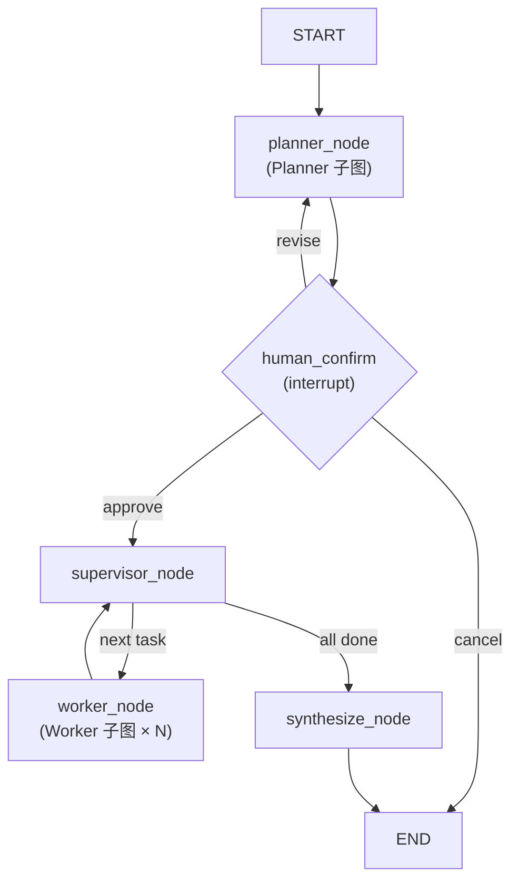

# Plan 模式 — 多 Agent 入口技术方案（草案 v0.2）

本文定义 **Plan 模式** 作为 llgraph 的 **独立多 Agent 入口**，采用 LangGraph 官方推荐的 **Supervisor + Subgraph（Worker）** 编排，与现有 **单 Agent 交互** 并列，互不替换。

相关文档：[会话上下文与历史.md](会话上下文与历史.md)、[项目结构.md](项目结构.md)、[cursor-agent.md](cursor-agent.md)。

**状态**：v0.3 已实现（Phase 1–3 基础能力）  
**相对 v0.1 的变化**：Plan 不再挂载在单 Agent 的 `/plan` 斜杠命令上；默认即为多 Agent 图；Worker 为 LangGraph 子图。  
**选型补充**：Plan 采用 StateGraph + Subgraph，便于后续 **Web 工作流可视化**（节点状态、interrupt、子图展开由图引擎提供，无需自研编排 UI 状态机）。

---

## 1. 产品定位：双入口

| 入口 | 命令 | 引擎 | 适用场景 |
|------|------|------|----------|
| **Agent 模式**（现有） | `llgraph -C <ws>` | 单图 `create_react_agent` | 日常问答、小范围改码、单链路排查 |
| **Plan 模式**（新增） | `llgraph plan -C <ws> [说明]` | **PlanGraph**（Supervisor + Worker 子图） | 大需求、多步骤、需先计划再执行、上下文易爆 |

原则：

- **Plan 默认就是多 Agent**，不在 Agent 模式里「切个 /plan  flag」凑数。
- 两种模式 **共用**：Gateway LLM、工具实现、Rules/Skills、索引、落盘目录规范、Survey 确认 UI。
- 两种模式 **不共用**：LangGraph 顶层图结构、默认 thread 命名、终端 Banner 与会话恢复逻辑。

```text
                    ┌─────────────────────┐
                    │      llgraph        │
                    └──────────┬──────────┘
              ┌────────────────┴────────────────┐
              ▼                                 ▼
     llgraph (Agent 模式)              llgraph plan (Plan 模式)
     create_react_agent                 PlanGraph (StateGraph)
     thread: cli-{hex}                  thread: plan-{hex}
```

---

## 2. 用户入口（CLI + 会话内）

### 2.1 CLI（主入口）

```bash
# Plan 模式：新建并进入交互
llgraph plan -C /path/to/workspace
llgraph plan -C . "梳理某业务域多仓依赖，先出计划"

# 列举本工作区历史 Plan 会话
llgraph plan -C . --list-plans

# 切换到 / 恢复某一 Plan 会话（进入后可看整体状态图与各 Worker 状态）
llgraph plan -C . --thread-id plan-a1b2c3d4

# 单轮（规划或执行某一阶段，视实现进度）
llgraph plan -C . --once "…"

# 与 Agent 模式对齐的通用参数
llgraph plan -C . -w          # 允许 worker 在 scope 内写（仍须在 Confirm Survey 勾选，见 §11）
llgraph plan -C . --trace steps

# 可选：Confirm 后每个 task 结束都 interrupt 等人确认（默认关闭，全自动跑完）
llgraph plan -C . --step
```

**Agent 模式保持不变**：

```bash
llgraph -C /path/to/workspace    # 单 Agent，无 Plan 图
llgraph --list-sessions          # 仅 cli-*；Plan 用 plan --list-plans
```

#### 历史 Plan 列举（`--list-plans`）

扫描本工作区所有 **Plan 会话**（`meta.json` 中 `session_kind=plan`），输出例如：

```text
  plan-a1b2c3d4  [executing]  梳理多仓依赖  · 3/5 tasks  ·  updated 2026-06-09 16:00
  plan-f9e8d7c6  [awaiting_confirm]  API 重构方案  ·  0/4 tasks  ·  updated 2026-06-08
```

字段：`thread_id`、`phase`、标题（`plan.json.title`）、task 进度、更新时间。  
与 Agent 的 `--list-sessions` **分开**，避免 `cli-*` / `plan-*` 混列表。

#### 切换 Plan 会话（`--thread-id plan-…`）

- 加载该 thread 的 checkpoint + `plan.json` + `plan_state.json`
- 若中断在 **human_confirm**，进入会话后提示待确认，可直接 `/plan confirm` 或 Survey
- 若 **executing** 中 worker 未完成，Supervisor 从 checkpoint 续跑或等人决策
- 进入后 **首屏展示整体状态图**（见 §2.4），随后进入 Plan 交互循环

### 2.2 Plan 会话内元命令

进入 `llgraph plan` 后，Plan 相关操作 **统一为 `/plan` 子命令**（避免与会话内其它斜杠命令混淆）：

| 命令 | 作用 |
|------|------|
| `/plan` / `/plan help` | 帮助 |
| `/plan graph` | 刷新并打印 **Plan 整体状态图**（父图 node + 各 task/Worker 状态，见 §2.4） |
| `/plan status` | 文字摘要：phase、当前 node、task 列表与 result 一行摘要 |
| `/plan list` | 列举本工作区历史 Plan（同 `--list-plans`） |
| `/plan switch <plan-thread-id>` | 切换 Plan 会话（Agent / Plan 模式内均可用） |
| `/plan confirm` | 人工确认计划（等价图 interrupt 恢复） |
| `/plan revise <说明>` | 回到规划节点，生成 plan v2 |
| `/plan cancel` | 终止 PlanGraph，标记 cancelled |
| `/plan handoff` | Plan 完成后，带 synthesize 摘要 **handoff 到 Agent 模式** 新 cli 会话（见 §11） |

不在 Agent 模式注册 `/plan`，以免与 Plan 子命令或「假 Plan」混淆。

### 2.3 `main.py` 路由（实现要点）

```text
main.py
├── llgraph index …     → cli/index_cli.py（已有）
├── llgraph search …    → cli/search_cli.py（已有）
├── llgraph plan …      → cli/plan_cli.py（新建）→ plan/graph.run_plan_session()
└── llgraph [message]   → 现有单 Agent 路径（不变）
```

### 2.4 Plan 整体状态图（必做）

每个 Plan 会话必须能展示 **一张完整工作流状态图**，覆盖：

1. **父图固定拓扑**（LangGraph PlanGraph 编译结果）  
2. **每个 node 的运行态**（pending / running / done / failed / waiting）  
3. **每个 Worker（task）在 supervisor→worker 链路上的状态**（对应 subgraph / task id）

#### 静态拓扑（所有 Plan 共用）

```text
  [START]
     ↓
  [Planner] ──→ [Confirm] ──→ [Supervisor] ⇄ [Worker×N] ──→ [Synthesize] ──→ [END]
                  ↑ interrupt
```

#### 动态展示（终端 ASCII 示例）

进入 Plan 会话、执行 `/plan graph` 或 task 状态变化后自动刷新：

```text
Plan plan-a1b2c3d4 · executing · 2/4 tasks

  [✓ Planner]
       ↓
  [✓ Confirm]
       ↓
  [● Supervisor] ──→ [✓ Worker w1: 扫描 RPC]
                 ╲
                  → [● Worker w2: 梳理 docs]  running…
                 ╲
                  → [○ Worker w3: 汇总依赖]  pending
                 ╲
                  → [○ Worker w4: …]         pending
       ↓
  [○ Synthesize]
       ↓
  [○ END]

图例: ✓ done  ● running/waiting  ○ pending  ✗ failed  ⏸ interrupt
```

实现要点：

| 项 | 说明 |
|----|------|
| 数据源 | `PlanState.phase` + checkpoint 当前 node + `plan.json.tasks[].status` + 可选 subgraph checkpoint |
| 模块 | `plan/workflow_view.py` — 由图定义 + 运行时状态生成 ASCII；Web 复用同一 **workflow snapshot** JSON |
| 落盘 | `plan_state.json` 内 `workflow_snapshot`（每次 node/task 变更更新），切换会话时 `/graph` 可离线渲染 |
| 会话内 | 切入历史 Plan 后 **首屏即 `/plan graph`**，再显示最近 synthesize/confirm 提示 |
| Banner | `terminal/plan_session.py` 启动 Banner 含一行压缩状态图或 `phase · task 进度` |

**Web 后续**：同一 `workflow_snapshot` 驱动节点图组件，无需第二套状态逻辑。

---

## 3. LangGraph 架构（官方推荐模式）

### 3.1 总览

Plan 模式顶层为 **`PlanGraph`**（`StateGraph`），不是单个 ReAct Agent 加工具。



| Node | 类型 | 职责 |
|------|------|------|
| **planner** | Subgraph（ReAct，只读工具） | 调研、生成 `plan.json`、拆分 task |
| **human_confirm** | 普通 node + **interrupt** | 展示计划；等待 Survey / `/plan confirm` / `/plan revise` |
| **supervisor** | 普通 node（宜规则+轻量 LLM） | 读 plan 状态，选下一个 task、重试或改 plan |
| **worker** | Subgraph（ReAct，scoped 工具） | 执行单个 task；输出 `result.json` |
| **synthesize** | 普通 node 或轻量 ReAct | 汇总各 task，生成最终用户可见报告 |

### 3.2 Worker / Planner 子图：复用 `create_react_agent`

子图内部 **仍用** LangGraph 预置 `create_react_agent`（与 today 单 Agent 一致），差异在：

- **system prompt charter**（Planner / Worker 角色不同）
- **工具集**（Planner 只读 + `save_plan`；Worker 按 task.scope）
- **独立 subgraph state**（messages 不进入父图全量，仅 **结构化输出** 回写父 state）

这与 LangGraph 文档中 *「每个 subagent 是一个 compiled graph」* 一致。

### 3.3 父图 State（草案）

```python
class PlanState(TypedDict):
    plan_id: str
    plan: dict                    # plan.json 内容
    phase: str                    # planning | awaiting_confirm | executing | completed | cancelled
    current_task_id: str | None
    task_results: dict[str, dict] # task_id → result.json 摘要
    user_messages: list           # 用户在本 Plan 会话的输入（供 confirm / revise）
    final_report: str | None
    error: str | None
```

**关键约束**：父 state **不存** worker 全量 tool trace；worker 子图结束后只 `return {"task_results": {id: summary}}`。

### 3.4 Checkpoint 与 thread

| 层级 | thread_id | checkpointer |
|------|-----------|--------------|
| Plan 会话（父图） | `plan-{8hex}` | 父图共享 `MemorySaver` + jsonl 落盘（扩展 session 类型） |
| Worker 子图 | 子图 `checkpointer: true` 或 `namespace=task_id` | 继承父 checkpointer，便于按 task 恢复 |

跨重启：

- 父图：恢复 `PlanState` + phase → 若 interrupt 在 confirm，继续等人输入。
- Worker：可从 `plan.json` 中 `status=running` 的 task 续跑子图。

落盘路径见 §5；`session_kind: "plan"` 写入 `meta.json`，与 `cli-*` 区分。

### 3.5 与后续 Web 图形化对齐（选型理由）

后续计划做 **Web 图形页面** 展示 Plan 进度时，**Subgraph 架构比「自管 thread + 工具 spawn」更合适**：

| 能力 | LangGraph PlanGraph | 自研 thread 编排 |
|------|---------------------|------------------|
| 工作流拓扑 | 编译期固定 node/边，**即 workflow DSL** | 需在 plan.json 外再维护一套 UI 状态机 |
| 节点状态 | `planning / awaiting_confirm / running / done` 与 checkpoint 一致 | 要自己 sync plan.json ↔ UI |
| 人工门禁 | 官方 **interrupt** → 前端显示「待确认」并 resume | 要自己 poll phase + Survey |
| 子 Agent 展开 | Worker **subgraph** 可嵌套展示（父节点 → 子 ReAct） | worker jsonl 与主会话割裂，前端要自己拼 |
| 流式事件 | `stream_mode="updates"` / `"debug"` 按 **node 粒度** 推送 | 只有整段 Agent stream，难拆 step |
| 恢复 | 同一 `thread_id` 从 checkpoint 续跑 | 需分别恢复父 thread 与各 worker thread |

**原则**：终端 Phase 1 仍可用文本 trace；**图结构一次定义**，Web 层主要做：

1. 订阅 LangGraph run events（node start/end、interrupt、subgraph）
2. 渲染节点图（planner → confirm → supervisor → worker×N → synthesize）
3. interrupt 时渲染确认表单，调用 `graph.invoke(Command(resume=…))`

**不必**在业务层维护「当前在第几个 subagent、是否该画箭头」——这与 LangGraph Studio / 官方多 Agent 示例的展示模型一致。Agent 模式（单 ReAct）将来若上 Web，仍是「单聊天窗」；Plan 模式单独占 **工作流视图**。

实现上预留：`plan/graph.py` compile 时保留 **可序列化的图定义**（node 名、边、interrupt 点），供 Web 静态渲染；运行时状态来自 checkpoint + stream events。

---

## 4. 与单 Agent 模式的关系

### 4.1 代码复用（共享层）

新建 `llgraph/plan/`，但 **不复制** 工具与 LLM 逻辑：

| 共享模块 | Plan 模式用法 |
|----------|----------------|
| `core/llm.py` | 各子图创建 LLM |
| `core/tools.py` | `get_agent_tools(..., profile="planner"\|"worker")` |
| `core/filesystem_tools.py` 等 | 原样；Worker 外加 path scope 中间件 |
| `survey/` | human_confirm interrupt 后 Survey |
| `display/trace_display.py` | 展示父图 node 边界 + 子图 stream（需扩展） |
| `session/session_file_store.py` | 扩展支持 `plan-*` thread 与 PlanState 侧车 |

### 4.2 独立层（Plan 专用）

| 新模块 | 职责 |
|--------|------|
| `plan/graph.py` | 构建 `PlanGraph`，compile |
| `plan/nodes/planner.py` | Planner 子图 compile + invoke |
| `plan/nodes/worker.py` | Worker 子图 factory（按 task 参数化） |
| `plan/nodes/supervisor.py` | 确定性路由 + 可选 LLM 选 task |
| `plan/nodes/confirm.py` | interrupt、Survey、revise 分支 |
| `plan/plan_store.py` | `plan.json` / `result.json` 读写 |
| `plan/plan_registry.py` | 列举 / 切换历史 Plan 会话 |
| `plan/workflow_view.py` | 整体状态图 ASCII + `workflow_snapshot` |
| `cli/plan_cli.py` | `llgraph plan` 参数解析、进入 `run_plan_session` |
| `terminal/plan_session.py` | Plan 专用交互循环（可 fork `terminal/session.py`） |

### 4.3 为何 Plan 宜独立入口 + 官方多 Node

| 点 | 说明 |
|----|------|
| 语义 | Plan 本质是 **流程型**（规划→确认→执行→汇总），用图比用 ReAct 硬编排更清晰 |
| interrupt | `human_confirm` 用 LangGraph interrupt 是官方路径，比自建 phase 枚举稳 |
| 上下文 | 子图 checkpoint 隔离 worker；父图只留摘要，比「主 Agent 记 spawn 历史」干净 |
| 演进 | 后续加并行 worker（Send API / 多 worker 边）自然落在图上 |
| 产品 | 用户心智：`llgraph` = 快问快答；`llgraph plan` = 大活开 plan |
| **Web** | 图即工作流；interrupt/stream 驱动 UI，**不自研编排状态机** |

单 Agent 模式 **继续** 服务 80% 场景，避免所有用户为 Plan 图付复杂度。

---

## 5. 数据模型与落盘

### 5.1 目录

```text
<workspace>/.llgraph/plans/<plan_id>/
├── plan.json              # SSOT（phase、tasks）
├── plan.md                # 可选人类可读
└── tasks/
    └── <task_id>/
        └── result.json    # Worker 子图结构化产出

~/.llgraph/context/<ws-slug>/sessions/plan-{hex}/
├── messages.jsonl         # 父图可见对话（用户 + 汇总消息，非 worker 全 trace）
├── meta.json              # session_kind=plan, plan_id, phase, title
├── plan_state.json        # PlanState + workflow_snapshot（整体状态图）
└── subgraphs/
    └── <task_id>/
        └── messages.jsonl # Worker 子图完整 trace（按需）
```

### 5.2 `plan.json` / `result.json`

Schema 与 v0.1 基本相同（见旧版 §4.2–4.3），仅字段调整：

- `parent_thread_id` → 固定为 Plan 父 thread `plan-{hex}`
- task 增加 `subgraph_checkpoint_ns`（可选，供恢复）

示例 task scope 使用通用占位路径（如 `auth-api/**`），不写具体业务仓库名。

#### `workflow_snapshot`（状态图 SSOT，供 CLI / Web）

```json
{
  "graph_revision": "plan-graph-v1",
  "phase": "executing",
  "current_node": "supervisor",
  "nodes": [
    { "id": "planner", "status": "done" },
    { "id": "confirm", "status": "done" },
    { "id": "supervisor", "status": "running" },
    { "id": "synthesize", "status": "pending" }
  ],
  "tasks": [
    { "id": "w1", "title": "…", "status": "done", "worker_node_status": "done" },
    { "id": "w2", "title": "…", "status": "running", "worker_node_status": "running" }
  ],
  "updated_at": "2026-06-09T08:00:00Z"
}
```

`plan/plan_registry.py`：实现 `--list-plans`、`/plan list`、按 `thread_id` 解析 `plan_id`。

## 6. Supervisor 路由规则（确定性优先）

Supervisor node **默认用代码** 读 `plan.json`，减少 LLM 乱跑：

```text
1. 若 phase != executing → END 或回到 confirm
2. 取 tasks 中 status=pending 且 depends_on 均已 done
3. 若无 → 进入 synthesize
4. 若 failed 且 retry 未耗尽 → 同 task 再跑 worker 子图
5. 若 failed 且耗尽 → 写 blockers，interrupt 等人 `/plan revise`
6. 否则 → 调用 worker 子图执行该 task
```

可选：Supervisor 用 **小模型** 只在「多 pending 可并行」时选顺序（V2+）。

---

## 7. 分阶段实现

### Phase 0 — 评审

- [x] 双入口 CLI：`llgraph` vs **`llgraph plan`**
- [x] Confirm 后默认 **全自动** 执行 task；可选 `--step` 每 task interrupt
- [x] Worker 写文件：**Confirm Survey 单独勾选**
- [x] Plan 结束：**支持 `/handoff`** 到 Agent 模式
- [x] **列举历史 Plan**、**切换 Plan 会话**、会话内 **整体状态图**
- [x] worker trace 落 `subgraphs/`（推荐是）

### Phase 1 — PlanGraph 骨架 + Planner + Confirm + 状态图

| 交付 | 说明 |
|------|------|
| `llgraph plan` 入口 | `plan_cli.py` + `run_plan_session` ✅ |
| `--list-plans` / `--thread-id` | `plan_registry.py` ✅ |
| PlanGraph | planner → human_confirm（interrupt）→ supervisor → worker → synthesize ✅ |
| Planner 子图 | 只读 ReAct + 写 `plan.json` ✅ |
| Survey / `/confirm` / `/revise` | 恢复图执行；Survey 含 **「允许 Worker 写文件」** 勾选项 ✅ |
| **整体状态图** | `workflow_view.py`；切入会话首屏 `/graph` ✅ |

**验收**：列举/切换 Plan；新 Plan 出 plan + 确认；状态图随 phase 更新。

### Phase 2 — Supervisor + Worker 子图

| 交付 | 说明 |
|------|------|
| supervisor + worker nodes | 顺序执行 task ✅ |
| Worker 子图 | scoped 工具 + `result.json` ✅ |
| synthesize node | 汇总报告 ✅ |
| 失败重试 | supervisor 按 retry 策略 ✅ |

**验收**：2+ task 顺序跑通；父会话上下文明显小于单 Agent 同等任务。

### Phase 3 — 增强

- 只读 task 有限并行（`max_parallel_workers`） ✅
- plan 版本化与 diff（`plan_version.py`） ✅
- trace UI：worker trace 落 `subgraphs/<task_id>/messages.jsonl` ✅
- **Web Plan 视图**：`workflow_snapshot` + `GRAPH_DEFINITION` 预留 ✅
- **Handoff**：`/handoff` → cli thread + manifest ✅

---

## 8. 配置（`agent.json` → `plan` 段）

```json
{
  "plan": {
    "enabled": true,
    "plans_dir": ".llgraph/plans",
    "planner": {
      "readonly": true,
      "max_turns": 40
    },
    "worker": {
      "max_turns": 30,
      "default_allow_write": false
    },
    "supervisor": {
      "max_parallel_workers": 1
    },
    "confirm_via_survey": true,
    "auto_run_after_confirm": true,
    "step_confirm_each_task": false,
    "handoff_enabled": true
  }
}
```

- `auto_run_after_confirm`：Confirm 后 Supervisor **自动顺序跑完**所有 task（默认 `true`）。
- `step_confirm_each_task`：为 `true` 或 CLI `--step` 时，**每个 task 结束后 interrupt**（默认 `false`）。
- Confirm Survey 字段（固定项）：`approve` / `revise` / `cancel` + **`allow_worker_write`**（bool，控制 plan 内 task 是否可写）。

配置加载：用户 `~/.llgraph/agent.json` 为底，工作区覆盖（与现有一致）。

---

## 9. 安全与权限

- **Planner 阶段**：默认只读；`-w` 不自动放开 Planner（仅影响 Worker task 且需在 plan 中显式 `allow_write`）。
- **Worker**：`scope.path_globs` + Sandbox + EditConfirmGate。
- **Plan 目录**在 `.llgraph/` 下，不默认进业务 git。

---

## 10. 风险与对策

| 风险 | 对策 |
|------|------|
| 双入口维护成本 | 工具/LLM 共享；Plan 仅增 `plan/` 包 |
| 子图 trace 难展示 | 终端按 node 分段；worker 详情读 `subgraphs/` |
| checkpoint 复杂度 | Phase 1 仅父图 interrupt；Phase 2 再加 worker namespace |
| 用户混淆两种模式 | Banner 明确 `llgraph plan`；Agent 模式不提供 `/plan` |

---

## 11. 已确认产品决策（v0.3）

| # | 问题 | **结论** |
|---|------|----------|
| 1 | CLI 名称 | **`llgraph plan`** |
| 2 | Confirm 之后 | **默认全自动**跑完所有 task；需要时用 **`--step`** 或配置 `step_confirm_each_task: true` 改为每 task interrupt |
| 3 | Worker 写文件 | **Confirm Survey 单独勾选**「允许 Worker 写文件」；未勾选则 worker 仅只读（即使 CLI 带 `-w`） |
| 4 | Plan 结束 | **提供 handoff**：会话内 `/handoff` 或结束后提示，带 synthesize 摘要打开 **Agent 模式** 新 `cli-*` 会话 |
| 5 | 历史 Plan | **`llgraph plan --list-plans`**、会话内 **`/plan list`** |
| 6 | 切换 Plan | **`llgraph plan --thread-id plan-…`**、会话内 **`/plan switch plan-…`**（Agent / Plan 模式） |
| 7 | 整体状态图 | **必做**：`/plan graph` + 切入首屏；`workflow_snapshot` 供 CLI/Web 共用 |

### Confirm Survey 草案

```text
请确认计划「{title}」（共 {n} 个 task）：
  [1] 确认并开始执行（默认全自动跑完各 task）
  [2] 修改计划（/back → revise）
  [3] 取消
  [ ] 允许 Worker 在本计划内写入文件（docs/代码，受 task scope 限制）
```

勾选写权限后写入 `plan.json` → `execution.allow_worker_write: true`，Supervisor/Worker 子图据此装配工具。

### Handoff 行为

1. Plan 处于 `completed`（或用户主动 `/plan handoff`）  
2. 创建新 `cli-{hex}`，manifest 注入 `<plan-handoff>`：plan_id、final_report 摘要、artifacts 路径  
3. 提示：`llgraph -C . --thread-id cli-{hex}` 继续单 Agent 深聊  

---

## 12. 实现顺序（Phase 1 任务清单）

1. `cli/plan_cli.py` — 参数解析（含 `--list-plans`、`--thread-id`、`--step`）  
2. `plan/plan_registry.py` — 列举 / 切换 Plan 会话  
3. `plan/plan_store.py` — plan.json  
4. `plan/workflow_view.py` — 整体状态图 + workflow_snapshot  
5. `plan/state.py` — `PlanState`  
6. `plan/graph.py` — compile PlanGraph（planner → confirm）  
7. `plan/nodes/planner.py` — `create_react_agent` 子图  
8. `plan/nodes/confirm.py` — interrupt + Survey（含 allow_worker_write）  
9. `terminal/plan_session.py` — 交互循环；切入首屏 `/plan graph`  
10. `session/*` — `plan-*` thread、meta.session_kind  
11. `/help`、Banner、文档  

Phase 2 再增：`supervisor.py`、`worker.py`、`synthesize.py`、handoff 实现。

---

## 13. 对照表

| 维度 | Agent 模式（现有） | Plan 模式（v0.2） |
|------|-------------------|-------------------|
| 入口 | `llgraph` | `llgraph plan` |
| 顶层图 | `create_react_agent` ×1 | `PlanGraph` StateGraph |
| Subagent | 无 | Worker 子图（官方 subgraph） |
| 计划确认 | survey（对话内） | 图 interrupt + Survey |
| thread | `cli-*` | `plan-*` |
| 适用 | 短任务 | 大任务、多步骤 |
| 历史会话 | `--list-sessions` (cli-*) | `--list-plans` / `/plan list` (plan-*) |
| 状态图 | 无 | **整体 workflow 图** + 各 Worker 状态 |

---

**修订记录**

- v0.1：Plan 挂在单 Agent `/plan`，Worker 为独立 thread 调 `build_agent`  
- v0.2：独立 CLI + LangGraph Supervisor/Subgraph；Web 对齐说明  
- v0.3：**产品决策确认**；历史 Plan 列举/切换；**整体状态图**；handoff / Survey 写权限 / 默认全自动执行
